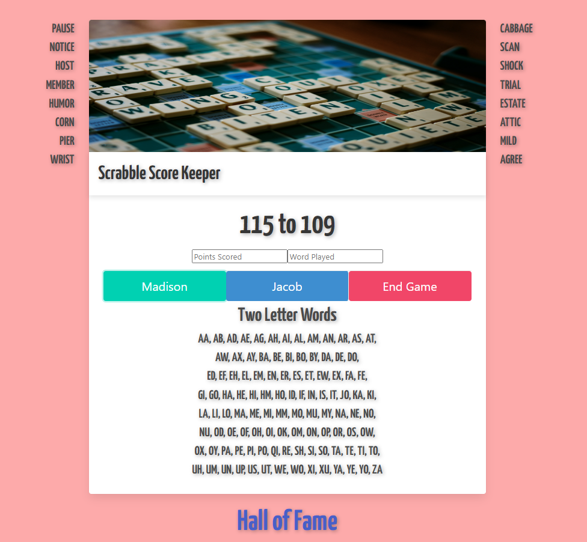

<h1>Scrabble Scorekeeper with Leaderboard</h1>

A scorekeeper for playing Scrabble that allows you to track your score and words played for two players. With this branch I have added the ability to keep track of winners, win total, highest scoring word, and its total in a leaderboard using MongoDB. If you don't want to set up a local database this build is still able to be played straight through your browser, but without the leaderboard. This is a personal project I made for my girlfriend and myself but feel free to update the names in the code to match your needs!.. unless your names just so happen to be Madison and Jacob.

<h2>Features</h2>
<ul>
  <li>Track points scored for two players.</li>
  <li>Tracks words played for two players displayed on the left and right of the container.</li>
  <li>Upon clicking end game you will be redirected to a victory screen for the player with the higher score!</li>
  <li>If you set up a local database using MongoDB you can click the <b>Hall of Fame</b> link to take you to the leaderboard which is updated when End Game is confirmed</li>
  <li>If you are up for another game you can click the <b>New Game?</b> link to take you back to the scorekeeper.</li>
</ul>

<h2>Usage</h2>
<ol>
  <li>Clone the repository to your local machine.</li>
  <li>Open <code>index.html</code> in browser.</li>
  <li>Enjoy!</li>
</ol>
  or
<ol>
  <li>Ensure you have Node.js installed on your machine</li>
  <li>Clone the repository: <code>https://github.com/ContagionIsMe/Scrabble-Scorekeeper-with-Leaderboard</code></li>
  <li>Install dependencies</li>
  <li>Run <code>node app.js</code></li>
  <li>Enjoy!</li>
</ol>

<h2>Dependencies for Leaderboard feature</h2>
<ol>
  <li>body-parser: ^1.20.2</li>
  <li>ejs: ^3.1.9</li>
  <li>express: ^4.18.2</li>
  <li>mongoose: ^8.0.0</li>
</ol>

  
  
  

